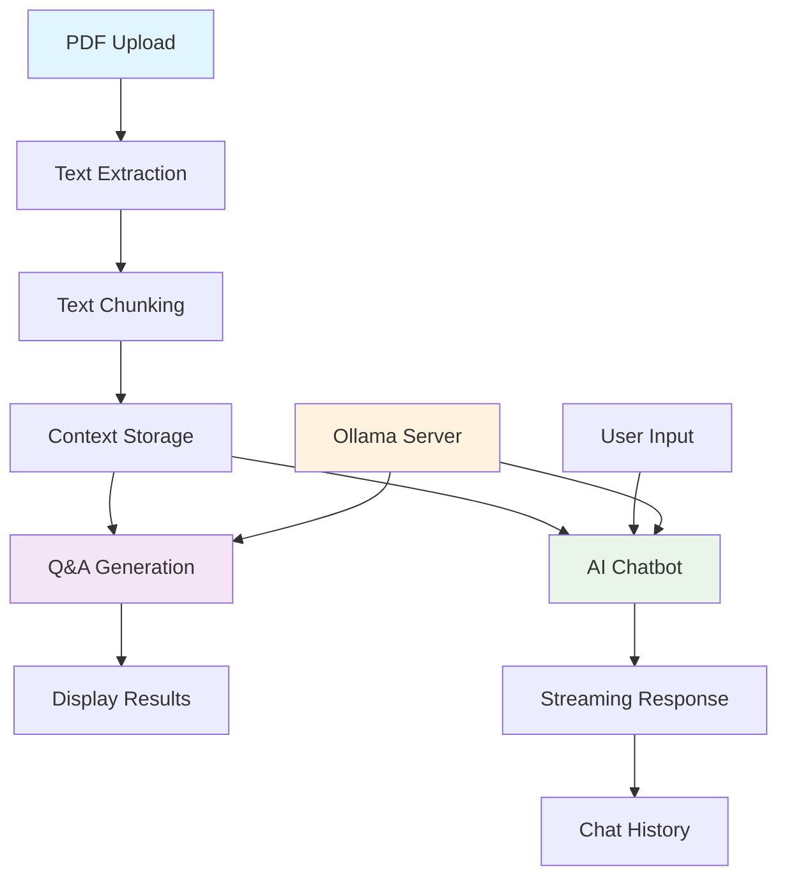

# Enhanced PDF Q&A with AI Chatbot

A Streamlit-based web application that combines automated question-answer generation from PDF documents with an interactive AI chatbot, powered by Ollama's local LLM inference engine using IBM's Granite-3 model.


## 🎯 Features

- **📄 PDF Processing**: Extract and analyze text from specific PDF pages
- **❓ Automated Q&A Generation**: AI-powered question-answer pair creation
- **🤖 Context-Aware Chatbot**: Interactive AI assistant with document context
- **🔄 Streaming Responses**: Real-time text generation for better UX
- **🏠 Local Processing**: Complete privacy with no external API dependencies
- **📚 Session Management**: Persistent chat history and Q&A tracking
- **🎨 Modern UI**: Clean, responsive interface with custom styling

## 🏗️ System Flow



### Detailed System Workflow

1. **PDF Upload & Processing**
   ```
   User uploads PDF → PyPDF2 extracts text → Text chunked into segments
   ```

2. **Q&A Generation Pipeline**
   ```
   Text chunks → Ollama API → Granite3 → Structured Q&A pairs → Display
   ```

3. **Context-Aware Chat**
   ```
   User question + PDF context → System prompt → Ollama streaming → Real-time response
   ```

4. **Session Management**
   ```
   All interactions stored in Streamlit session state → Persistent during session
   ```

## ⚠️ Known Limitations & Considerations

### 1. **Token Embedding Limitations (Gemma-2b)**
- **Issue**: If a token is not present in Gemma-2b's embedding table, the model cannot generate meaningful representations for that token
- **Impact**: May result in poor or no results for documents containing highly specialized terminology, rare words, or domain-specific jargon
- **Mitigation**: Gemma-2b uses SentencePiece tokenization with a large 256k vocabulary, which splits unknown words into known subwords, reducing but not eliminating this issue

### 2. **Context Window Limitations**
- **Issue**: Limited context size (2000-3000 characters) to avoid token limits
- **Impact**: Large documents may lose important context when chunked
- **Mitigation**: Strategic page selection and intelligent chunking

### 3. **Local Processing Constraints**
- **Issue**: Requires sufficient local hardware resources (8GB+ RAM recommended)
- **Impact**: Performance degrades on low-spec machines
- **Mitigation**: Reduce chunk sizes and limit concurrent processing

### 4. **PDF Processing Limitations**
- **Issue**: Cannot process scanned PDFs or image-based content
- **Impact**: Limited to text-based PDFs
- **Mitigation**: Use OCR-processed PDFs for scanned documents(pytesserect)

### 5. **Model-Specific Constraints**
- **Issue**: Response quality depends on Gemma-2b's training data and capabilities
- **Impact**: May struggle with highly technical or recent information
- **Mitigation**: Use appropriate prompting and context management

## 🚀 Quick Start

### Prerequisites

- Python 3.8+
- 8GB+ RAM (16GB recommended)
- 2GB free storage for model

### Installation

1. **Install Python dependencies**
   ```bash
   pip install streamlit PyPDF2 requests
   ```

2. **Install and setup Ollama**
   ```bash
   # Install Ollama (visit https://ollama.ai/download for your OS)
   
   # Pull Grante-3 model
   ollama pull granite3-dense
   
   # Start Ollama server
   ollama server
   ```

3. **Run the application**
   ```bash
   streamlit run pdf_qa_app.py
   ```

4. **Access the app**
   Open `http://localhost:8501` in your browser

## 💻 Usage

### Basic Workflow

1. **Upload PDF**: Choose a PDF file using the file uploader
2. **Configure Settings**: Select page range and questions per chunk
3. **Process Document**: Click "Generate Questions & Answers" 
4. **Review Q&A**: Examine generated question-answer pairs
5. **Chat with AI**: Use the chatbot for interactive document exploration

### Advanced Usage

- **Page Selection**: Focus on specific sections for targeted analysis
- **Chunk Optimization**: Adjust chunk size based on content density
- **Context Management**: Clear history regularly for optimal performance

## 🏛️ Architecture

### Components

```
┌─────────────────┐    ┌─────────────────┐    ┌─────────────────┐
│   Streamlit     │    │     Ollama      │    │   granite3      │
│   Frontend      │◄──►│   API Server    │◄──►│   LLM Model     │
└─────────────────┘    └─────────────────┘    └─────────────────┘
         │                       │                       │
         ▼                       ▼                       ▼
┌─────────────────┐    ┌─────────────────┐    ┌─────────────────┐
│   PDF Reader    │    │   HTTP Client   │    │ Local Inference │
│   (PyPDF2)      │    │   (Requests)    │    │    Engine       │
└─────────────────┘    └─────────────────┘    └─────────────────┘
```

### Core Functions

- **`test_ollama_connection()`**: Verify server connectivity
- **`extract_text_from_pdf()`**: Extract text from PDF pages
- **`chunk_text()`**: Split content into processable segments
- **`generate_qa_pairs()`**: Create Q&A pairs using LLM
- **`ollama_chat_stream()`**: Handle streaming chat responses
- **`parse_qa_pairs()`**: Structure LLM output into Q&A format

## 🛠️ Configuration

### Environment Variables
```python
OLLAMA_BASE_URL = "http://localhost:11434"  # Ollama server endpoint
MODEL_NAME = "granite3-dense:latest"                     # LLM model identifier
```

### Generation Parameters
```python
# Q&A Generation
temperature = 0.7        # Creativity vs consistency
max_tokens = 400         # Response length limit
chunk_size = 400         # Words per processing chunk

# Chat Generation  
temperature = 0.3        # More focused for chat
max_tokens = 500         # Longer responses allowed
context_limit = 2000     # PDF context character limit
```

## 🔧 Troubleshooting

### Common Issues

| Issue | Solution |
|-------|----------|
| Ollama connection failed | Run `ollama serve` and verify port 11434 |
| Model not found | Execute `ollama pull gemma:2b` |
| No text extracted | Check PDF format, try different pages |
| Slow performance | Reduce chunk size, clear session history |
| Memory issues | Restart Ollama, reduce context size |

### Performance Tips

- **Hardware**: Use SSD storage for faster model loading
- **Memory**: Close other applications during processing
- **Processing**: Limit page ranges for large documents
- **Context**: Keep chat history under 10 messages

## 🔒 Privacy & Security

- **Local Processing**: All data processed locally via Ollama
- **No External APIs**: No data transmitted to external services
- **Session-Based**: Data stored only during browser session
- **No Persistence**: History cleared when session ends

## 🤝 Contributing

1. Fork the repository
2. Create a feature branch (`git checkout -b feature/AmazingFeature`)
3. Commit changes (`git commit -m 'Add AmazingFeature'`)
4. Push to branch (`git push origin feature/AmazingFeature`)
5. Open a Pull Request

### Development Guidelines

- Follow PEP 8 style guidelines
- Add docstrings to all functions
- Include error handling for external API calls
- Test with various PDF formats and sizes
- Update documentation for new features

## 📋 Roadmap

- [ ] **Multi-model support**: Add support for other Ollama models
- [ ] **Vector database**: Implement ChromaDB for better retrieval
- [ ] **Export features**: PDF/Word export of Q&A pairs
- [ ] **Batch processing**: Handle multiple PDFs simultaneously  
- [ ] **OCR integration**: Support scanned PDF documents
- [ ] **Advanced chunking**: Semantic-aware text segmentation
- [ ] **User authentication**: Multi-user session management
- [ ] **API endpoints**: REST API for programmatic access

## 🐛 Known Issues

1. **Large PDFs**: Memory usage increases significantly with large documents
2. **Complex formatting**: Tables and complex layouts may not parse correctly
3. **Special characters**: Some Unicode characters may cause processing errors
4. **Concurrent users**: Single-threaded design limits multi-user scenarios

## 📚 Documentation

- [Full Documentation](./documentation.md) - Comprehensive guide
- [API Reference](./api_reference.md) - Function documentation  
- [Troubleshooting Guide](./troubleshooting.md) - Common issues and solutions

## 📄 License

This project is licensed under the MIT License - see the [LICENSE](LICENSE) file for details.

## 🙏 Acknowledgments

- **IBM**: For the Granite3 model
- **Ollama**: For local LLM inference capabilities  
- **Streamlit**: For the excellent web framework
- **PyPDF2**: For PDF text extraction functionality

## 📞 Support

- **Issues**: Create an issue on GitHub
- **Discussions**: Use GitHub Discussions for questions
- **Email**: [your-email@example.com]

---

**Built with ❤️ using Streamlit, Ollama, and Granite-3**
